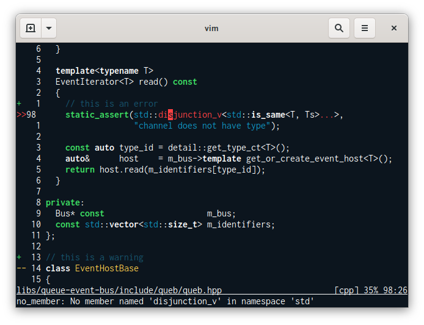

# focusedpain
A dark vim colorscheme.

## Motivation

This colorscheme tries to combine the minimalism of [vim-colors-plain][] with the color palette of [panic.vim][].

## Screenshot

[vim-colors-plain]: https://github.com/andreypopp/vim-colors-plain
[panic.vim]: https://github.com/jdsimcoe/panic.vim
